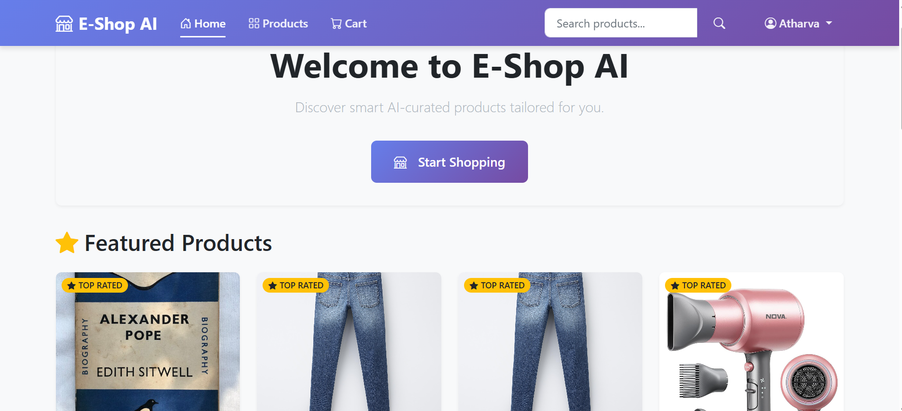
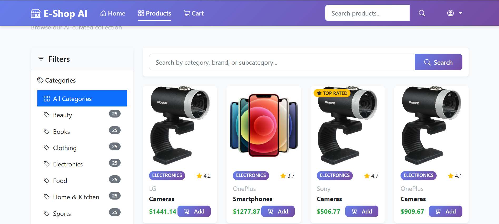
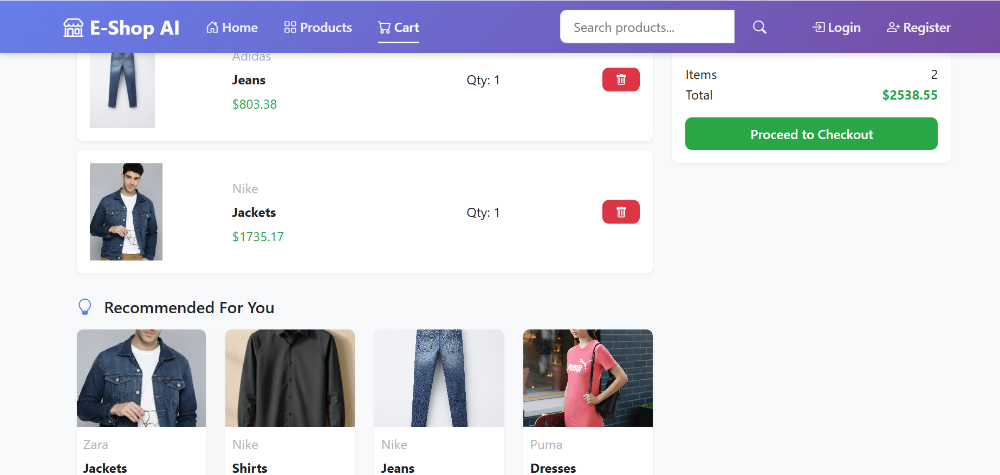
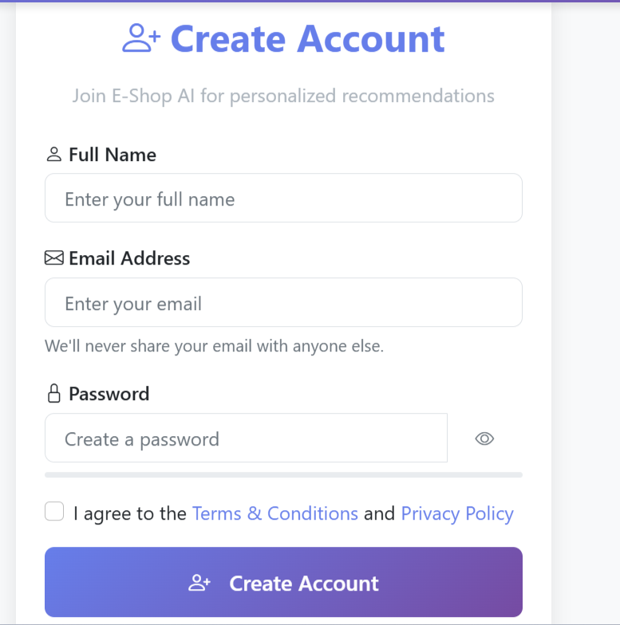

# 🛒 Machine Learning Based E-Commerce Recommendation System

A complete **AI-powered E-Commerce Web Application** built using **Flask, Python, MySQL and Content-Based Filtering**.

This system provides smart product recommendations based on user interests and product similarity.

---

## 🚀 Features

- 🔐 Secure User Authentication (Login / Register)
- 🛍️ Product Listing Page
- 🛒 Add to Cart System
- 🤖 Smart AI-Based Recommendations
- 🏷️ Category-Based Filtering
- 📊 CSV-Based Sample Product & Customer Data
- ⚠️ Custom 404 & 500 Error Pages
- 📱 Clean & Responsive UI

---

## 🧠 Recommendation Logic

This project uses **Content-Based Filtering**:

- Product similarity calculated using:
  - Pandas
  - NumPy
- User interaction data
- Category & keyword matching
- Similar product scoring

---

## 🛠 Technologies Used

- Python
- Flask
- MySQL
- Pandas
- NumPy
- HTML
- CSS
- JavaScript

---

## 📂 Project Structure

```
ecommerce-recommendation-system/
│
├── app.py
├── requirements.txt
├── sample_customer_data.csv
├── sample_product_data.csv
│
├── templates/
│   ├── login.html
│   ├── register.html
│   ├── home.html
│   ├── products.html
│   ├── recommendation.html
│   ├── 404.html
│   └── 500.html
│
├── static/
│   ├── css/
│   ├── js/
│   └── images/
│
└── screenshots/
    ├── login-page.png
    ├── home-page.png
    ├── products-page.png
    ├── recommendation-page.png
    └── register-page.png
```

---

## ⚙️ Installation & Setup

### 1️⃣ Clone the repository

```bash
git clone https://github.com/YOUR-USERNAME/ecommerce-recommendation-system.git
cd ecommerce-recommendation-system
```

---

### 2️⃣ Create Virtual Environment

```bash
python -m venv venv
venv\Scripts\activate
```

---

### 3️⃣ Install Requirements

```bash
pip install -r requirements.txt
```

---

### 4️⃣ Setup MySQL Database

Create database in MySQL:

```sql
CREATE DATABASE ecommerce_recommendation;
```

Update your DB credentials in `app.py`:

```python
app.config['MYSQL_HOST'] = 'localhost'
app.config['MYSQL_USER'] = 'root'
app.config['MYSQL_PASSWORD'] = ''
app.config['MYSQL_DB'] = 'ecommerce_recommendation'
```

---

### 5️⃣ Run Application

```bash
python app.py
```

Open in browser:

```
http://127.0.0.1:5000
```

---

## 📸 Project Screenshots

### 🔐 Login Page


---

### 🏠 Home Page


---

### 🛍️ Products Page


---

### 🤖 Recommendation Page


---

### 📝 Register Page


---

## 🎯 Future Improvements

- Collaborative Filtering
- Deep Learning Recommendation Model
- Admin Dashboard
- Payment Gateway Integration
- Deployment on Cloud (Render / AWS)

---

## 👨‍💻 Author

**Atharva Krishna Parab**

---

## ⭐ If You Like This Project

Give it a ⭐ on GitHub!

